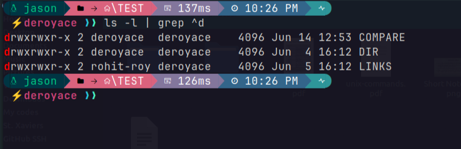

# Linux Commands


## ls command
- `ls`    : to list directories and files
- `ls -a` : to list all files and directories alongwith hidden ones
- `ls -r` : lists files and directories in reverse alphabetical order.
- `ls -l ` : to give detailed info of directories/files like when created and by whom, date modified, size, permissions and ownerships
- `ls -al` : to list all hidden files with details.
- `ls -lh` : to list file with details of file size in - KB (kilobytes).
- `ls -lR` : to list all the directories and their - sub-directories with details.
- `ls -lR dirName` : to list the details of - sub-directories of the specified dirName.
- `ls -F` : to identify files and directories - seperately. Directories will be listed with a "/" - symbol at the end of directory name
- `ls -i` : displays the inode [index number] of each - file
- `ls --sort=t` or  `ls -t` : displays the list of files / directory sorted by time. Similarly sort=v/s/e for sort by version/size/extension

<br>

## Change Directory
- `cd` : to change directory to home/user directory
- `cd ~` : to go to home/user directory
- `cd /` : to go to root directory
- `cd [DIR-NAME]` : to change directory or go to that directory
- `cd ..` : to go to the parent directory
<br>

## Path Locate
- `pwd`   : shows the path of current working directory
- `locate [SEARCH-NAME]` : to search files by name
-  `whereis [APP/COMMAND]` : to locate binary file, manual page files of applications or commands
- `which [APP/COMMAND]`: to locate a command or an application

<br>

## File management

### Create or manipulate file
- `touch [FILE-NAME]` : to create a file
- `touch -m [FILE-NAME]` : change  modification  time of the  file
- `touch -a [FILE-NAME]` : change the access time of the file
- `touch test{1..5}.txt` : create 5  files with name test1.txt, test2.txt, ..., test5.txt
- `cat > [FILE-NAME]` : to rewrite a file. If the filename not present then new file with given name will be created
- `cat >> [FILE-NAME]` : to append new contents to the file
[ **NOTE**: _for cat > or >> ... commands, inorder to exit writing mode of the file press CTRL+D._]

### Delete files
- `rm [FILE-NAME]` : to remove dir/ file/ folder.
-  `rm *` : removes all the files in the current directory. 
-  `rm *.txt` : removes all the files in the current directory that has .txt extension.
- `rm -i [FILENAME]` : to make command prompt the user with each filename while deleting

### Move and Copy
- `mv [SOURCE] [DESTINATION]` : to move the file into the given destination or path.
- `cp [FILE-1] [FILE-2]` : copies the file1 contents to file2.
- `cp [FILE-NAME]` : will copy the file in the directory.

### Show file contents
- `cat [FILE-NAME]` : to show the contents of file in the terminals.

### Change filename
- `mk [PRESENT-FILENAME] [NEW-FILENAME]` : this changes the file or folder name.

### Octal form
- `od  [FILENAME]` : to display a file contents in octal form

### file command
- used to display file type
    ```
    file video.mp4
    ```
    Output:
    ```
    video.mp4: ISO Media, MP4 Base Media v1 [ISO 14496-12:2003]
    ```

### Locate a file
- `find [FILENAME]` : search for files in a directory hierarchy


### File Comparison

#### cmp command
- Compare two files byte by byte
    ```
    cmp file1.txt file2.txt
    ```
    Output:
    ```
    file1.txt file2.txt differ: byte 8, line 1
    ```
#### diff command
- used to compare files line by line
    ```
    diff [FILE-1] [FILE-2]
    ```    
Examples:
- to show the difference of two files side by side
    ```
    diff -y file1.txt file2.txt
    ```
    - `-y` : side-by-side  output in two columns

### File  Permissions

#### chmod (change mode)
- use to change permissions of a file or directory of all types of users
- Control of a file:
    - `d` : directrory
    - `-` : no permission given [NOTE: the leftmost `-` implies its a file]
    - Permissions
        - `r` : read(4)
        - `w` : write (2)
        - `x` : executable (1)

    Example:
    ```
    chmod +x program.sh
    ```
    The above command grants executable permissions to the program.sh file for all the users
    ```
    -rwxrwxr-x  1 deroyace deroyace    127 May 23 15:3 counter.sh
    drwxr-xr-x  3 deroyace deroyace   4096 Mar 29 19:2 Desktop
    ```
    - `rwx` is written 3 times consecutively. This means,
        - first set of rwx implies **USER / OWNER** permission
        - second set implies **GROUP** permissions same as owner.
        - third set implies **OTHERs** outside the group.
        - left most single symbol `d` indicates it is a directory. It can be `l` or `-` also.
            - `l` means its a shortcut link of a file or a directory.
            - `-` means it is a file.
- **Numerical Short hand or Octal  Mode**
    - Another way to use chmod is to provide the permissions you wish to give to the owner, group, and others as a three-digit number which is basically octets that are formed by combinations of 4,2 and 1.
    - The leftmost digit represents the permissions for the owner. 
    - The middle digit represents the permissions for the group members. 
    - The rightmost digit represents the permissions for the others.
   
          Value   Symbols    Meanings/ Permissons
            0       ---       No permission
            1       --x       Execute
            2       -w-       Write
            3       -wx       Write and execute
            4       r--       Read
            5       r-x       Read and execute
            6       rw-       Read and write
            7       rwx       Read, write, and execute
        Examples:
        - Give   read,  write,  execution  permissions to all types of users:
            ```
            chmod 777 program.sh
            ```
        - Give   read,  write,  execution  permissions only to User and Group:
            ```
            chmod 770 program.sh
            ```
        - Give   read,  write,  execution  permissions to User and read nad execution permission to Group and only execution permission to  other users:
            ```
            chmod 751 program.sh
            ```

    - Default permissions for:
        - `file`     : **664** (-rw-rw-r--)
        - `folder`   : **775** (drwxrwxr-x)

-  **Symbolic Mode**
    ```
     Symbol     Meaning
    -------------------
       a         all users
       u         user
       g         group
       o         others
    ```
    Examples:
    - Give read, write, execute permission to user and execute permission to group and other
        ```
        chmod u+rwx,go+x program.sh
        ```
    - Give read permission to all, write permission to  user and group, execute persmission to group only:
        ```
        chmod u+rw,g+rx,o+r program.sh
        ```
    - Give read, write, execute permission to user and execute permission to group and other:
        ```
        chmod u+rwx,go+x program.sh
        ```
    -  Make all files and sub-directories in the directory TEST executable by all users
        ```
        chmod -R a+x TEST
        ```
    - Remove executable  permission from group and other of a file
        ```
        chmod go-x file.txt
        ```

#### chgrp (change group)
- `chgrp [GROUP-NAME] [FILE/FOLDER NAME]`
 : to assign a file/folder to a specific group
<br>

#### chown (change owner)
-  `sudo chown [USER-NAME] [FILE/FOLDER-NAME]`
 :  to change the user or ownership of a file/folder:

### File Compression

####  tar command
- it is used to  compress and archive files
- **TAR** short for Tape Archive

Examples:

- To create a tar and includes the files specified in the command:
    ```
    tar cf file.tar [FILE-NAMES]
    ```
    - `c` : create new archive
    - `f` : to specify name of the archive files
    - `[FILE-NAMES]` : represent files that are to be included in the tar file

- Extract From tar Archive
    ```
    tar xf file.tar
    ```
    - `x` : extract files from an archive

- Creating an uncompressed tar Archive:

    ```
    tar cvf file.tar *.sh
    ```
    - This command creates a **tar** file called `file.tar` which is the **Archive** of all `.sh` files in the current directory.
    - `v` : verbosely  list  files processed

- Extracting from uncompressed tar archive:
    ```
    tar xvf file.tar
    ```

- Create a tar.gz Compressed Archive:
    ```
    tar czf files.tar.gz files
    ```

- Extract files from tar.gz
    ```
    tar xzf files.tar.gz
    ```
<br>

## Directory

### Directory Creation
- `mkdir [FOLDER-NAME]` : to create a folder/ directory
- `mkdir folder1 folder2 folder3` : to create multiple folders/ directory at once
- `mkdir file{1..9}` : this will create 10 folders with name 'file 1', 'file 2', ..., 'file 10'
- `mkdir -v folders{1..7}` : this will create folders & will skip the ones which are already created before with the same name.
- `mkdir -p [PATH]` : will create 'cmds' folder in the given path but if the path doesn't exits then it will be created.

### Remove directoy
- `rmdir [DIR-NAME]` : to remove the file/ folder/ directory.
- `rmdir myFolder*` : removes all folders that begins with name 'myFolder'
- `rmdir *` : removes all the folder in the present directory.
- `rmdir myFolder{1..7}` : removes the folders from 'myFolder 1' to 'myFolder 7'
NOTE: rmdir cannot delete diectories having files / folders inside.
- `rm -R [DIR-NAME]` : to delete the directory with the files inside.
- `rm -r [DIR-NAME]`: to delete all the files and NON-EMPTY directories and also the child folders content.

<br>

## Wild  cards
- `*`, `?` are  wilcards

- Use of wild cards:

    - `ls *.txt` : list all files that ends with  .txt extension
        - `*` implies any number of characters
    
    - To list all files that starts with "file" and succeeds by any one character and then ".txt":
    `ls file?.txt`
    
    - `ls file???.txt`
        - `?` two characters
        -  `???` means any 3 character
    

<br>

## sort command

- to sort lines of  text files lexicographically

Examples:

- sort the lines  of file in alphabetical order:
    ```
    sort  [FILENAME]
    ```

- sort the lines of file in reverse order:
    ```
    sort -r [FILENAME]
    ```

- output the sorted file into a new file:
    ```
    sort  [FILENAME] > [NEW-FILE]
    ```

- output the sorted lines of a file into a new file without duplicates:
    ```
    sort [FILENAME] > uniq > [NEW-FILE]
    ```

<br>

##  ln command
- used to make links between files

- `ln [FILE-NAME] [HARD-LINK]`: Create a hard link for a file (same inode)

- `ln -s [FILE-NAME] [SOFT-LINK]`: Create a soft link for a file

- `ln -s .. [SOFT-LINK]`: Create a soft link for the parent directory you are currently located in

<br>

## grep  command
- prints each line of a file that matches a pattern

Examples:
- list all directories present in the current  folder
    ```
    ls -l | grep ^d
    ```
    - `^d` : matches those lines that starts with letter 'd'

    Output:
    

- Show the line numbers that matches the pattern "hello", ignoring case
    ```
    grep -i -n "hello" file.txt
    ```
    - `-n` : displays line number
    - `-i` : ignores case

- Ignore those lines that matches the pattern "hello"
    ```
    grep -v "hello" [FILENAME]
    ```

- To highlight words in a file or command output that ends with letter 'A':
    ```
    grep "\b\w*A\b" [FILENAME]
    ```
    - `-b` : boundary
    - `\w*` : any number of characters
-  Specifically display and highlight only those words that starts with letter 'A' or 'a':
    ```
    grep -o -i "\b\A\w*\b" [FILENAME]
    ```
    - `-o` : outputs only matching words
    - `-i` : ignores case [ _NOTE: it works only when capital letter is used in the command to find the required search. ]_
<br>

## CUT

- used to extract characters or remove sections from each lines of files

Examples:
- To extract first three characters of every line:
    ```
    cut -c -3 [FILENAME]
    ```
- To extract characters starting from 2nd character of every line:
    ```
    cut -c 2- [FILENAME]
    ```
    
- To extract last three characters of every line:
    ```
    cat [FILENAME] | rev | cut -c -3 | rev
    ```
- To display selected columns sorted by ID:
    ```
    cut -d $'\t' -f1-4 movies.txt | sort -k1 -n
    ```
    - `$'\t'` : tab space delimiter [taking columns seperated by TAB space]
    - `-d`  : delimiter
    - `-n`  : numeric value sorted
    - `-f1-4` : columns 1 to 4
    - `-k1` : sort by first column
    - `-k2` : sort by second column

<br>

## PASTE
    
- `paste [FILENAME-1] [FILENAME-2]` : concatenates two files. by default the delimiter is TAB
- To explicity specify a delimiter/ concat file contents using delimiter:
    ```
    paste -d '-' [FILENAME-1] [FILENAME-2]
    ```
<br>

## Compare
- Used to compare two sorted files
    
    Contents of file1.txt :
    ```
    ANGULAR
    DJANGO
    ELECTRON
    FLASK
    NODEJS
    REACT
    YARN
    ```
    Contents of file2.txt :
    ```
    ANGULAR JS
    FASTAPI
    FLASK
    NEXT JS
    NODEJS
    REACTJS
    YARN
    ```
    Command line input:
    ```
    comm --total file1.txt file2.txt
    ```
    Output:
    ```
    ANGULAR
    	    ANGULAR JS
    DJANGO
    ELECTRON
    	    FASTAPI
    		        FLASK
    	    NEXT JS
    		        NODEJS
    REACT
    	    REACTJS
    		        YARN
    4	4	3	total
    ```

    - unmatched file of first file is displayed in 1st column
    - unmatched file of first file is displayed in 2nd column
    - matched lines in 3rd column
    - `--total` : counts the number of lines that are matched and unmatched for both the files.

<br>

## User and Group handling
### Switch user
- `su root` : to go to the root account. '$' will change to '#'; su -> switch user
- `sudo su` : switching user

### User Password
- `passwd` : to change your login or root account  password.
- `passwd [Account Name]` : to change password of that particular account.

- `id [USER-NAME]` : shows user id; root account id is 0.

### Create New User / Group 
- `sudo adddgroup [GROUP-NAME]`
 : to create new User Group
- `sudo adduser [USERNAME]` : to create a new user account.
- `sudo usermod -aG sudo [USERNAME]` : to make the user as a root user.

### Remove User / Group
- `sudo groupdel {GROUP-NAME}`
 : to remove a group:

<br>

## Process management

- `top`: list all processes and shows the cpu, memory usage and running background apps.
- `ps aux` : lists all processes that are currently running in the device.
    - `a` : --all Display information about other users' processes as well as your own.
    - `u` : Display the processes belonging to the specified usernames.
    - `x` : When displaying processes matched by other options, include processes which do not have a controlling terminal.
- `kill [PID]` : kills or disables a process
- `kill -9 [PID]` : stop a process

<br>

## OS, CPU and Kernel information

- `uname -a` : show kernel information
- `xdpyinfo | grep 'dimensions:'` : to check screen resolution
Result from above cmd:  dimensions:    1366x768 pixels (361x203 millimeters)

- To check distro release version:
    - `lsb_release -a` : provides certain LSB (Linux Standard Base) and distribution-specific information.
    - `cat /etc/os-release`

- `echo $XDG_CURRENT_DESKTOP` : to check Desktop Environment
- `cat /proc/cpuinfo` : cpu information

<br>

## Memory information
- `df` : shows the disk space usage
- `du` : shows directory space usage
- `free` : shows memory and swap usage
- `cat /proc/meminfo` : memory information

<br>

## Other useful commands
- `man [COMMAND]` : shows the mannual page of the command
- `history` : list all the cmds used (last 500 cmds)
- `lsusb` : shows the USB buses and devices connected
- `whatis [COMMAND]` : to give brief description or use of that command
- `whoami` : checks whether you are root user/ whats the user name you are logged in as
- `who` : display information about users who are currently logged in
-  `w` : show who is logged on and what they are doing
- `tty` : print the file name of the terminal connected to standard input
- `!!` : executes the last command
- `exit` : log out current session

<br>

## Shortcuts
- `CTRL + ALT + T`    : to open terminal [_NOTE: this may vary in distros, may not work for some_]
- `CTRL + SHIFT + W`
      or 
`CTRL + D`    : to close terminal
- `CTRL + L`    : to clear the terminal
- `CTRL + C`    : to terminate the program
- `CTRL + D`    : TO log out of current session, similar to exit
- `CTRL + Z`    : to pause/suspend the program
- `CTRL + A`    : to go to start of the line/ command
- `CTRL + E`    : to go to end of the line/ command
- `CTRL + U`    : to clear the command
- `CTRL + R`    : type to bring up a recent command

---

